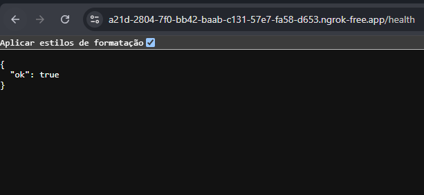

# PedeAii WhatsApp Bot

[Wiki / Documentação](https://www.notion.so/Wiki-Documenta-o-3cc30cca103e4704b14b5e96ad849c9b)

#### Configuração da Aplicação
<details>
  <summary><b>Mostrar instruções</b></summary>

  * Ter o Node na versão 21 ou o Docker instalado para rodar via container
  * Rodar o comando **`npm i`** para instalar as dependencias ou esperar gerar a imagem do container
  * Rodar o comando **`cp .env.example .env`** ou se estiver no windows **`Copy-Item .\.env.example .\.env`**.
  * Rodar o comando **`npm run dev`** ou **`npm run watch`** para rodar o projeto no ambiente de desenvolvimento
</details>

--------
#### Configuração do Container de Inversão de Dependencia
<details>
  <summary><b>Mostrar instruções</b></summary>

  * No arquivo de container em: Kernel/Container/Container.ts, será registrado os containers que representam inversão de dependencia.
  * Terá que atribuir no genérics **<>** uma interface que será implementada e qual assinatura que essa interface terá no método **bind()**. e.g:

```ts
import { Container } from "inversify";

const container = new Container();

container.bind<SuaInterface>('AssinaturaDaInterface');
```

* Terá que assinar uma classe com o método **to()**, que será usada para quando essa interface ser implementada, quando implementar a interface, e chamar no construtor, o container se achar. e.g:

```ts
import { Container } from "inversify";
import { SuaClasse } from "SuaClasse";

const container = new Container();
container.bind<SuaInterface>('AssinaturaDaInterface').to(SuaClasse);
```

* Para quando estiver na sua classe de controles na aplicação, terá que mostrar ao *bind()* do container qual controlador ele chamara na injeção estipulada pelo decorador **@injectable()**, e por fim exportar a variável de assinatura do container. e.g:

```ts
import { Container } from "inversify";
import { SuaClasse } from "SuaClasse";
import { SeuController } from "SeuController";

const container = new Container();
container.bind<SuaInterface>('AssinaturaDaInterface').to(SuaClasse);
container.bind<SeuController>(SeuController).toSelf();

export { container };
```

* Para usar a inversão de dependencia terá que assinar as classes e no construtor qual interface está injetando. e.g:
```ts
import { inject, injectable } from "inversify";
import { SuaInterface } from "SuaInterface";

@injectable()
export class SuaClasse implements SuaInterface {
  constructor(
    @inject('SuaInterface') private readonly suaInterface: SuaInterface
  ) {}

  seuMetodo() {
    return this.suaInterface.metodoDaInterface();
  }
}
```

> **Repare que estamos pegando o contrato metodoDaInterface da interface que será implementada na classe, porém no container, estamos utilizando uma classe de fato, visto que uma interface não tem parte lógica, só espelha do que se trata o negócio e suas regras.
Então temos o método bind() que assina a injeção, e o método to() que atribui o que vai reassinar ou sobreescrever na injeção.**

* Para finalmente usar deverá assinar esse mesmo container com o método **get()**, assinando em seu genéric <> a classe que vai usar e passar a mesma classe no argumento, e adicionar nas rotas do roteamento de endpoints. e.g:

```ts
import { Request, Response, Router } from 'express';
import { container } from 'Kernel/Container/Container';
import { SeuController } from 'SeuController';

const seuController = container.get<SeuController>(SeuController);

const messageRouter = Router();

messageRouter.post('/message', async (req: Request, res: Response) => seuController.create(req, res));
```
</details>

-----

* #### LINK -> [Tunel: Ngrok](https://ngrok.com/) <- LINK
Logar com sua conta do Google ou Github.
* Adicionar seu token no ngrok: **`ngrok config add-authtoken {$SEUTOKEN}`**.
[Link para pegar o token](https://dashboard.ngrok.com/get-started/your-authtoken).
* Você vai pegar seu token:


* Depois você vai se deparar com essa página e clicar:

* Vai clicar nesse botão:

* E colocar seu link e o endpoint: **`{$SEU LINK NGROK}/health`**
